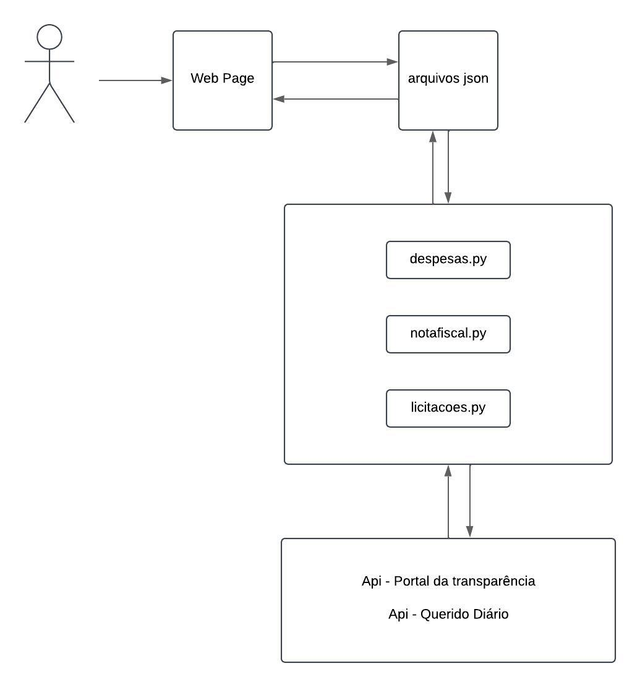

# **Arquitetura do Projeto**

## **Introdução**

### Propósito

O propósito deste projeto é descrever a arquitetura de software do projeto **Gastos-DF-2024-02**, uma iniciativa que visa promover a transparência na gestão dos gastos públicos no Distrito Federal.

### Objetivo

O objetivo principal do projeto é desenvolver uma plataforma que permita o monitoramento e análise de gastos públicos, facilitando o acesso à informação e promovendo a transparência para os cidadãos do Distrito Federal.

### Definições, Acrônimos e Abreviações

- **API**: Application Programming Interface (Interface de Programação de Aplicações).
- **PTGF**: Portal da Transparência do Governo Federal.
- **QD**: Querido Diário.

## **Tecnologias Escolhidas**

| Tecnologia   | Versão |
| ------------ | ------ |
| Python       | 3.13.0 |
| Flask        | 3.0.3  |
| HTML         | HTML5  |
| CSS          | CSS3   |
| GitHub Pages | -      |

## **Visão dos Componentes**

### Arquitetura Monolítica
A arquitetura monolítica é um modelo tradicional de desenvolvimento de software que consiste em uma única unidade de código que executa todas as funções do sistema. Nesta arquitetura, todos os componentes estão interconectados dentro de um mesmo pacote ou aplicação. Isso significa que os módulos responsáveis pelo front-end, back-end e pela manipulação de dados interagem diretamente entre si sem camadas adicionais ou separação de responsabilidades em diferentes serviços.

#### Vantagens da Arquitetura Monolítica
- **Facilidade de Desenvolvimento Inicial**: Como todos os componentes estão em um só lugar, é mais simples configurar e implementar.
- **Performance**: A comunicação interna entre módulos é mais rápida, pois ocorre dentro do mesmo processo.
- **Deploy Simplificado**: Apenas um pacote ou aplicação precisa ser implantado.

#### Desafios
- **Escalabilidade**: É mais difícil escalar componentes específicos do sistema sem replicar toda a aplicação.
- **Manutenção**: Com o crescimento do projeto, o código pode se tornar complexo e mais propenso a erros.
- **Acoplamento**: Alterar um componente pode impactar outros, exigindo uma bateria maior de testes.

## Organização dos Arquivos

O projeto segue uma estrutura clara para organizar os módulos e garantir a manutenção:

### Arquivos principais:
- **despesas.py**: Centraliza os dados relacionados a despesas gerais do Distrito Federal.
- **notafiscal.py**: Gerencia as informações sobre notas fiscais eletrônicas.
- **licitacoes.py**: Processa e organiza dados de licitações públicas.

#### **Outros Componentes**

- **Arquivos JSON**: Utilizados para armazenamento temporário de dados obtidos da API.
- **Configurações do Flask**: Incluem rotas e inicialização do servidor.

### **Front-end**

O **front-end** será desenvolvido utilizando HTML e CSS para estruturar e estilizar a interface do usuário. A interface será otimizada para facilitar a navegação e a compreensão dos dados relacionados aos gastos públicos, garantindo uma experiência visual agradável e acessível.

### **Back-end**

O **back-end** será desenvolvido em **Python**, utilizando o **Flask** como framework para construção da API. O **Flask** permitirá a criação de rotas e a manipulação de dados de forma eficiente e escalável, servindo de ponte entre o **back-end** e o **front-end**.

#### **Interação com Sistemas Externos**

O sistema será integrado às **APIs** do **PTGF** e do **QD**, permitindo que os dados sobre os gastos públicos sejam obtidos diretamente do Portal da Transparência do Governo Federal.

#### **Coleta de Dados**

A coleta de dados será feita por meio das **APIs** do **PTGF** e do **QD**, que disponibilizam informações detalhadas sobre os gastos públicos. O sistema filtrará esses dados para focar nos gastos específicos relacionados ao Distrito Federal, permitindo que a plataforma forneça informações precisas e relevantes para a análise.

#### **Modelagem de Dados**

- **Valores dos Gastos Públicos**: Os dados serão disponibilizados mensalmente e anualmente, permitindo uma análise temporal dos gastos.
- **Órgãos**: Os dados serão organizados e apresentados separadamente por órgão público, para facilitar a visualização dos gastos específicos de cada instituição.
- **Análises e relatórios gráficos**: A implementação de ferramentas de visualização de dados (como gráficos e dashboards) pode melhorar a interpretação das informações.

O sistema irá incluir métricas e indicadores de fácil compreensão, ajudando o usuário a realizar uma análise aprofundada dos gastos públicos, com base nos critérios de interesse.

| Versão  |    Data    | Descrição                                      | Autor                                              | Revisão                                                      |
| :-----: | :--------: | ---------------------------------------------- | -------------------------------------------------- | ------------------------------------------------------------ |
| `0.1.0` | 08/11/2024 | Criação do documento de arquitetura do projeto | [Gabriel Barbaceli](https://github.com/Nibaacriba) | [João Pedro](https://github.com/johnaopedro)                 |
| `0.1.1` | 19/12/2024 | Atualização do documento de arquitetura do projeto | [Artur Mendonça](https://github.com/ArtyMend07) [Gabriel Lopes](https://github.com/BrzGab) | [Gabriel Barbaceli](https://github.com/Nibaacriba) [Julia Gabriela](https://github.com/JuliaGabP) |
| `0.1.0` | 08/11/2024 | Inclusão do uso de duas APIs na coleta de dados | [Artur Mendonça](https://github.com/ArtyMend07) | [Julia Gabriela](https://github.com/JuliaGabP)                 |

